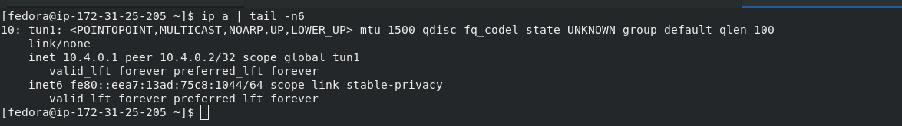
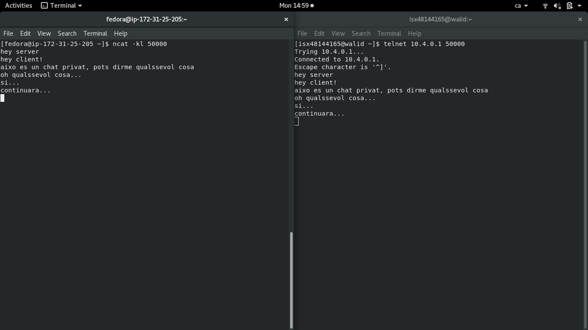

# OpenVPN amb certificats propis
## Preparació pràctiques
### Abans de començar, hem de crear els nostres propis certificats
1. Crear key pel certificat:
```
[isx48144165@walid openvpn]$ openssl genrsa -out ca-key.pem 1024
```

2. Crear entitat CA propia (Veritat Absoluta):
```
[isx48144165@walid openvpn]$ openssl req -new -x509 -nodes -sha1 -days 365 -key ca-key.pem -out ca-crt.pem
```

3. Creem/editem el fitxer de configuració de la generació de certificats, **ca.conf** (indica què certifiquen):
```
basicConstraints = critical,CA:FALSE
extendedKeyUsage = serverAuth,emailProtection
```

### Determinar extensions a utilitzar, tant al client com al server
- **ext.server.conf**
```
basicConstraints       = CA:FALSE
nsCertType             = server
nsComment              = "OpenSSL Generated Server Certificate"
subjectKeyIdentifier   = hash
authorityKeyIdentifier = keyid,issuer:always
extendedKeyUsage       = serverAuth
keyUsage = digitalSignature, keyEncipherment
```

- **ext.client.conf**
```
basicConstraints        = CA:FALSE
subjectKeyIdentifier    = hash
authorityKeyIdentifier = keyid,issuer:always
```

### Claus i certificats al servidor
1. Generem key del server
```
[isx48144165@walid openvpn]$ openssl genrsa -out vpnserver-key.pem
```

2. Generem req del server
```
[isx48144165@walid openvpn]$ openssl req -new -key vpnserver-key.pem -out vpnserver-req.pem
```

3. Finalment, generem el certificat dels server
```
[isx48144165@walid openvpn]$ openssl x509 -CAkey ca-key.pem -CA ca-crt.pem -req -in vpnserver-req.pem -days 365 -CAcreateserial -extfile ext.server.conf -out vpnserver-crt.pem
```

### Claus i certificats al client (per a cada client)
1. Genrem key del client
```
[isx48144165@walid openvpn]$ openssl genrsa -out vpnclient1-key.pem
```

2. Genrem req del server
```
[isx48144165@walid openvpn]$ openssl req -new -key vpnclient1-key.pem -out vpnclient1-req.pem
```

3. Finalment, generem el certificat del client
```
[isx48144165@walid openvpn]$ openssl x509 -CAkey ca-key.pem -CA ca-crt.pem -req -in vpnclient1-req.pem -days 365 -CAcreateserial -extfile ext.client.conf -out vpnclient1-crt.pem
```

## Exemple 3: Túnel Host to Host amb certificats propis
### Al server
- Creem túnel:
```
[fedora@ip-172-31-25-205 openvpn]$ sudo openvpn --remote 37.14.86.93 --dev tun1 --ifconfig 10.4.0.1 10.4.0.2 --tls-server --dh dh2048.pem --ca ca-crt.pem --cert vpnserver-crt.pem --key vpnserver-key.pem --reneg-sec 60
```


### Al client
- Creem túnel:
```
[isx48144165@walid openvpn]$ sudo openvpn --remote 35.177.24.194 --dev tun1 --ifconfig 10.4.0.2 10.4.0.1 --tls-client --ca ca-crt.pem --cert vpnclient1-crt.pem --key vpnclient1-key.pem --reneg-sec 60
```


### Comprobacions
1. Al server:
```
nc -kl 50000
```

2. Al client:
```
telnet 10.4.0.1 50000
```

- **Com podem veure, els dos hosts utilitzen el túnel per fer un chat privat**


## Exemple 4: Túnel Network to Network amb certificats propis
### En aquesta pràctica s'ha de fer el que s'ha fet anteriorment (exemple 3), afegint-hi dues ordes:
- Primer de tot, ens hem d'asegurar que el IP forwarding està activat als 2 host:
```
echo 1 > /proc/sys/net/ipv4/ip_forward
```

- I activar el TUN (packet forwarding through the firewall)
```
iptables -A FORWARD -i tun+ -j ACCEPT
```

1. Al servidor hem de fer:
```
[fedora@ip-172-31-25-205 ~]$ sudo route add -net 10.0.0.0 netmask 255.255.255.0 gw 10.4.0.1
```

2. Al client hem de fer:
```
[isx48144165@walid openvpn]$ sudo route add -net 10.0.1.0 netmask 255.255.255.0 gw 10.4.0.2
```

- El que hem fet consisteix en dir a **host**, que si tota la seva
xarxa local vol enviar dades a la xarxa del **client** ho ha de fer per el túnel VPN (en
lloc de per el gw de internet). I viceversa.

## OpenVPN com a servei
### Al server
1. Primer de tot, hem de copiar els certificats del server, la clau del server i el dh2048.pem a **/etc/openvpn/server**.

2. Seguidament, hem de crear l'archiu de configuració a la mateixa ruta: [server.conf](./server/server.conf).

3. Crear el socket a **/usr/lib/systemd/system**: **openvpn-server@server.service**:
```
[Unit]
Description=OpenVPN server
After=network.target

[Service]
PrivateTmp=true
Type=forking
PIDFile=/var/run/openvpn/%i.pid
ExecStart=/usr/sbin/openvpn --daemon --writepid /var/run/openvpn/%i.pid --cd /etc/openvpn/server --config %i.conf

[Install]
WantedBy=multi-user.target
```

4. Una vegada fet tot aixó, farà falta recarregar els daemon i iniciar el servei:
```
[fedora@ip-172-31-25-205 ~]$ sudo systemctl daemon-reload
[fedora@ip-172-31-25-205 ~]$ sudo systemctl start openvpn-server@server
[fedora@ip-172-31-25-205 ~]$ sudo systemctl status openvpn-server@server
● openvpn-server@server.service - OpenVPN local
   Loaded: loaded (/usr/lib/systemd/system/openvpn-server@server.service; disabled; vendor preset: disabled)
   Active: active (running) since Mon 2020-04-13 15:32:35 UTC; 5min ago
  Process: 2538 ExecStart=/usr/sbin/openvpn --daemon --writepid /var/run/openvpn/server.pid --cd /etc/openvpn/server --config server.conf (code=exite>
 Main PID: 2539 (openvpn)
    Tasks: 1 (limit: 1142)
   Memory: 1.3M
   CGroup: /system.slice/system-openvpn\x2dserver.slice/openvpn-server@server.service
           └─2539 /usr/sbin/openvpn --daemon --writepid /var/run/openvpn/server.pid --cd /etc/openvpn/server --config server.conf

Apr 13 15:32:35 ip-172-31-25-205.eu-west-2.compute.internal openvpn[2539]: /sbin/ip addr add dev tun0 local 10.8.0.1 peer 10.8.0.2
Apr 13 15:32:35 ip-172-31-25-205.eu-west-2.compute.internal openvpn[2539]: /sbin/ip route add 10.8.0.0/24 via 10.8.0.2
Apr 13 15:32:35 ip-172-31-25-205.eu-west-2.compute.internal openvpn[2539]: Could not determine IPv4/IPv6 protocol. Using AF_INET
Apr 13 15:32:35 ip-172-31-25-205.eu-west-2.compute.internal openvpn[2539]: Socket Buffers: R=[212992->212992] S=[212992->212992]
Apr 13 15:32:35 ip-172-31-25-205.eu-west-2.compute.internal openvpn[2539]: UDPv4 link local (bound): [AF_INET][undef]:1194
Apr 13 15:32:35 ip-172-31-25-205.eu-west-2.compute.internal openvpn[2539]: UDPv4 link remote: [AF_UNSPEC]
Apr 13 15:32:35 ip-172-31-25-205.eu-west-2.compute.internal openvpn[2539]: MULTI: multi_init called, r=256 v=256
Apr 13 15:32:35 ip-172-31-25-205.eu-west-2.compute.internal openvpn[2539]: IFCONFIG POOL: base=10.8.0.4 size=62, ipv6=0
Apr 13 15:32:35 ip-172-31-25-205.eu-west-2.compute.internal openvpn[2539]: IFCONFIG POOL LIST
Apr 13 15:32:35 ip-172-31-25-205.eu-west-2.compute.internal openvpn[2539]: Initialization Sequence Completed
```

### Al client
1. Primer de tot, hem de copiar els certificats del client i la clau del client a **/etc/openvpn/client**.

2. Seguidament, hem de crear l'archiu de configuració a la mateixa ruta: [client.conf](./client/client.conf).

3. Crear el socket a **/usr/lib/systemd/system**: **openvpn-client@client.service**:
```
[Unit]
Description=OpenVPN client
After=network.target

[Service]
PrivateTmp=true
Type=forking
PIDFile=/var/run/openvpn/%i.pid
ExecStart=/usr/sbin/openvpn --daemon --writepid /var/run/openvpn/%i.pid --cd /etc/openvpn/client --config %i.conf

[Install]
WantedBy=multi-user.target
```

4. Una vegada fet tot aixó, farà falta recarregar els daemon i iniciar el servei:
```
[isx48144165@walid ~]$ sudo systemctl daemon-reload
[isx48144165@walid ~]$ sudo systemctl start openvpn-client@client
[isx48144165@walid ~]$ sudo systemctl status openvpn-client@client
● openvpn-client@client.service - OpenVPN local
   Loaded: loaded (/usr/lib/systemd/system/openvpn-client@client.service; disabled; vendor preset: disabled)
   Active: active (running) since Mon 2020-04-13 17:32:41 CEST; 6min ago
 Main PID: 6149 (openvpn)
    Tasks: 1 (limit: 4915)
   CGroup: /system.slice/system-openvpn\x2dclient.slice/openvpn-client@client.service
           └─6149 /usr/sbin/openvpn --daemon --writepid /var/run/openvpn/client.pid --cd /etc/openvpn/client --config client.conf

Apr 13 17:38:01 walid openvpn[4665]: Incoming Data Channel: Cipher 'AES-256-GCM' initialized with 256 bit key
Apr 13 17:38:01 walid openvpn[4665]: ROUTE_GATEWAY 192.168.1.1/255.255.255.0 IFACE=enp1s0 HWADDR=80:ce:62:d4:20:fd
Apr 13 17:38:11 walid openvpn[4665]: TUN/TAP device tun0 opened
Apr 13 17:38:11 walid openvpn[4665]: TUN/TAP TX queue length set to 100
Apr 13 17:38:11 walid openvpn[4665]: do_ifconfig, tt->did_ifconfig_ipv6_setup=0
Apr 13 17:38:11 walid openvpn[4665]: /sbin/ip link set dev tun0 up mtu 1500
Apr 13 17:38:11 walid openvpn[4665]: /sbin/ip addr add dev tun0 local 10.8.0.6 peer 10.8.0.5
Apr 13 17:38:11 walid openvpn[4665]: /sbin/ip route add 10.8.0.1/24 via 10.8.0.5
Apr 13 17:38:11 walid openvpn[4665]: WARNING: this configuration may cache passwords in memory -- use the auth-nocache option to prevent this
Apr 13 17:38:11 walid openvpn[4665]: Initialization Sequence Completed
```
