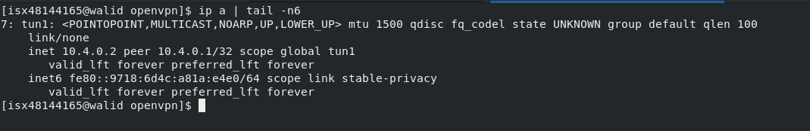

# OpenVPN amb certificats propis
## Preparació pràctiques
### Abans de començar, hem de crear els nostres propis certificats
1. Crear key pel certificat:
```
[isx48144165@walid openvpn]$ openssl genrsa -out ca-key.pem 1024
```

2. Crear entitat CA propia (Veritat Absoluta):
```
[isx48144165@walid openvpn]$ openssl req -new -x509 -nodes -sha1 -days 365 -key ca-key.pem -out ca-crt.pem
```

3. Creem/editem el fitxer de configuració de la generació de certificats, **ca.conf** (indica què certifiquen):
```
basicConstraints = critical,CA:FALSE
extendedKeyUsage = serverAuth,emailProtection
```

### Determinar extensions a utilitzar, tant al client com al server
- **ext.server.conf**
```
basicConstraints       = CA:FALSE
nsCertType             = server
nsComment              = "OpenSSL Generated Server Certificate"
subjectKeyIdentifier   = hash
authorityKeyIdentifier = keyid,issuer:always
extendedKeyUsage       = serverAuth
keyUsage = digitalSignature, keyEncipherment
```

- **ext.client.conf**
```
basicConstraints        = CA:FALSE
subjectKeyIdentifier    = hash
authorityKeyIdentifier = keyid,issuer:always
```

### Claus i certificats al servidor
1. Generem key del server
```
[isx48144165@walid openvpn]$ openssl genrsa -out vpnserver-key.pem
```

2. Generem req del server
```
[isx48144165@walid openvpn]$ openssl req -new -key vpnserver-key.pem -out vpnserver-req.pem
```

3. Finalment, generem el certificat dels server
```
[isx48144165@walid openvpn]$ openssl x509 -CAkey ca-key.pem -CA ca-crt.pem -req -in vpnserver-req.pem -days 365 -CAcreateserial -extfile ext.server.conf -out vpnserver-crt.pem
```

### Claus i certificats al client (per a cada client)
1. Genrem key del client
```
[isx48144165@walid openvpn]$ openssl genrsa -out vpnclient1-key.pem
```

2. Genrem req del server
```
[isx48144165@walid openvpn]$ openssl req -new -key vpnclient1-key.pem -out vpnclient1-req.pem
```

3. Finalment, generem el certificat del client
```
[isx48144165@walid openvpn]$ openssl x509 -CAkey ca-key.pem -CA ca-crt.pem -req -in vpnclient1-req.pem -days 365 -CAcreateserial -extfile ext.client.conf -out vpnclient1-crt.pem
```

## Exemple 3: Túnel Host to Host
### Al server
- Creem túnel:
```
[isx48144165@walid openvpn]$ sudo openvpn --remote 192.168.1.15 --dev tun1 --ifconfig 10.4.0.1 10.4.0.2 --tls-server --dh dh2048.pem --ca ca-crt.pem --cert vpnserver-crt.pem --key vpnserver-key.pem --reneg-sec 60
```


### Al client
- Creem túnel:
```
[isx48144165@walid openvpn]$ openvpn --remote 192.168.1.17 --dev tun1 --ifconfig 10.4.0.2 10.4.0.1 --tls-client --ca ca-crt.pem --cert vpnclient1-crt.pem --key vpnclient1-key.pem --reneg-sec 60
```

### Comprobacions
1. Al server:
```
nc -kl 50000
```

2. Al client:
```
telnet 10.4.0.1 50000
```

- **Simulació: només mostra el resultat que s'hauria d'obtenir**


## Exemple 4: Túnel Network to Network
